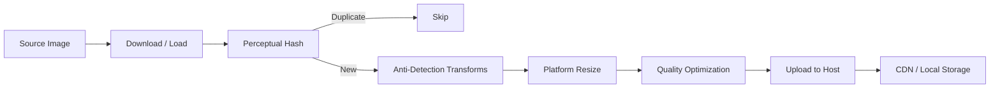

# Product Image Pipeline

Image processing pipeline for marketplace listings: anti-detection transforms, platform-specific resizing, watermarking, and quality optimization.

Built with **Pillow** — no OpenCV dependency, lightweight and portable.

---

## Pipeline Overview



## Features

### Anti-Detection Transforms

Subtle, individually imperceptible modifications that combined defeat reverse image search:

| Transform | Range | Purpose |
|---|---|---|
| Rotation | ±0.1–0.5° | Breaks pixel-grid alignment |
| Crop | 1–3% edges | Alters image boundaries |
| Brightness/Contrast | ±2–5% | Shifts histogram distribution |
| EXIF stripping | Full removal | Eliminates metadata fingerprint |
| Pixel noise | ±3 levels | Disrupts hash algorithms |
| Color channel shift | ±2 levels | Alters color signature |

All transforms are **deterministic** with a seed for reproducibility.

### Platform-Specific Resizing

Pre-configured rules for major marketplaces:

- **Wallapop**: 1080×1080, square crop, JPEG
- **eBay**: 1600×1600, white background fill, JPEG
- **Amazon**: 2000×2000, white background fill, JPEG

Aspect ratio is always preserved — images are fit within bounds and padded with a configurable fill color.

### Quality Optimization

- Binary search for optimal JPEG quality within a file-size budget
- Progressive JPEG for large images
- Format conversion (PNG → JPEG, JPEG → WebP)
- Heuristic quality scoring (0–100)

### Perceptual Hashing

- Average hash algorithm (8×8 grayscale, 64-bit)
- Hamming distance for similarity comparison
- Duplicate detection before processing (saves compute)
- Pure PIL implementation — no OpenCV needed

### Image Hosting

Pluggable backends via abstract base class:

- **LocalImageHost** — filesystem storage for development
- **CDNImageHost** — CDN upload interface for production

## Usage

```python
from src.pipeline import ImagePipeline
from src.hosting import LocalImageHost

host = LocalImageHost("./output")
pipeline = ImagePipeline(host, anti_detection_seed=42)

# Single image
result = pipeline.process_image("product.jpg", platforms=["wallapop", "ebay"])
# → {"wallapop": "/output/wallapop_abc123.jpg", "ebay": "/output/ebay_def456.jpg"}

# Batch processing
results = pipeline.process_batch(
    ["img1.jpg", "img2.jpg", "img3.jpg"],
    platforms=["wallapop"],
    on_progress=lambda current, total: print(f"{current}/{total}")
)
```

### Individual Transforms

```python
from PIL import Image
from src.transforms import apply_anti_detection, resize_for_platform, add_watermark

img = Image.open("product.jpg")

# Anti-detection (deterministic with seed)
protected = apply_anti_detection(img, seed=42)

# Platform resize
wallapop_ready = resize_for_platform(img, "wallapop")

# Watermark
branded = add_watermark(img, "© MyStore", position="bottom-right", opacity=0.3)
```

## Design Decisions

### Why anti-detection transforms?

In the resale market, suppliers often use reverse image search to identify unauthorized resellers. By applying subtle, imperceptible transforms, we ensure product images don't match the originals in search engines while maintaining visual quality for buyers.

### Why perceptual hashing over MD5?

MD5/SHA hashes change with a single pixel flip — useless for detecting near-duplicates. Perceptual hashing captures visual similarity: two photos of the same product from slightly different angles will have similar hashes, enabling intelligent deduplication that saves processing time and storage.

### Why Pillow over OpenCV?

OpenCV is powerful but heavy (~50 MB). For the transforms we need (rotation, crop, brightness, noise), Pillow is sufficient, installs in seconds, and has no native compilation issues across platforms.

## Running Tests

```bash
pip install -r requirements.txt
pytest -v
```

## Project Structure

```
src/
├── transforms/          # Image modification operations
│   ├── anti_detection.py    # Reverse-search defeat
│   ├── resize.py            # Platform-specific sizing
│   ├── watermark.py         # Brand overlay & removal
│   └── quality.py           # Compression optimization
├── pipeline/
│   └── image_pipeline.py    # Orchestrator
├── hosting/
│   ├── base.py              # Abstract host interface
│   ├── local_host.py        # Filesystem backend
│   └── cdn_host.py          # CDN backend
└── utils/
    └── image_hash.py        # Perceptual hashing
```

## License

MIT
